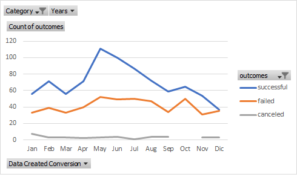
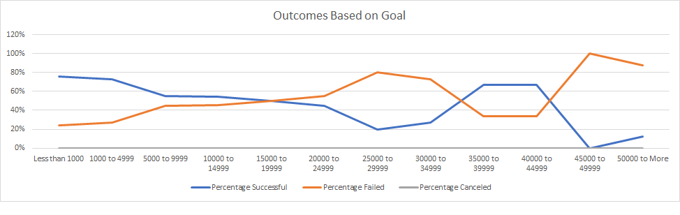

# Kickstarting with Excel

## Overview of Project

### Purpose
The aim of this project is to analyze how well performed were the campaign outcomes of
Louise's play Fever, which was closed to its fundraising goal in a short amount of time, based on their launch dates and their funding goals 

## Analysis and Challenges

### Analysis of Outcomes Based on Launch Date

As we can see in both images, The succcesful campaings were greater than failed
and canceled. Also, December was the lowest number of succesful camapaigns. I found that succesful and failed Campaigns seems to be 
converging to the same number either for all categories or Theater category. The highest number of successful campaigns were
launched in May and June for all categories and Theater Category.  

### Analysis of Outcomes Based on Goals

The Goal range with the highest succesful rate was "Less than 1000" range and the lowest succesful rate was "45000 to 49000" goal range, which matched with the highest failed rate  

### Challenges and Difficulties Encountered

For the "Outcomes Based on Launch Date" chart, one difficult situation would have been if the pivot table did not split the date conversation rate in months and years, because that would have forced
to create another column manually and adding to pivot table.

For the "Outcomes Based on Goals" chart, the challenged part was using COUNTIFS between 3 and 4 criterias. I did not find a shortcut to use one formula and apply that for the rest of the cells.  

## Results

### What are two conclusions you can draw about the Outcomes based on Launch Date?

1. It seems that there is a correlation between succesful outcomes and failed outcomes
2. There were few months that had more succesful and failed outcomes than the rest of the months. 

### What can you conclude about the Outcomes based on Goals?

There was less cases of range of goals with low percentage of success.
There was less cases of range of goals with higher percetange of failed. 

### What are some limitations of this dataset?
The data is mainly focused in the US. Therefore, it is not reliable to compare outcomes of campaigns between countries. 

### What are some other possible tables and/or graphs that we could create?
Could be a graph between Average donation and Outcomes of Campaigns or Outcomes Based on goals
Other table/graph could be the Number of Backers for each range of Goals

